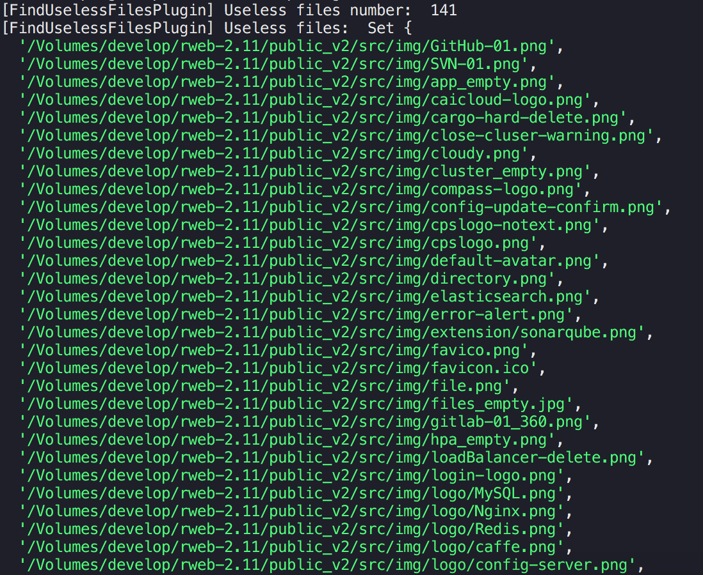

# Find useless files plugin
A simple webpack plugin to help you find files that your project does not depended on.

## Original intention
公司中前端项目微服务化之后, 从一个项目中拆分出多个模块, 需要尽可能的删除不需要的文件以减小 repo 的体积(最重要的是文件多了太乱, so messy!)

## Ability
可以列出某文件夹(默认 public_v2)下的不会被打包的文件, 需要手动删除.

为了确保万无一失, 没有加自动删除功能

## Install
```bash
npm i --save-dev find-useless-files-plugin
```
```bash
yarn add --dev find-useless-files-plugin
```

## Usage
**webpack.config.js**
```js
const FindUselessFilesPlugin = require('find-useless-files-plugin');
module.exports = {
  // ...
  plugins: [
    new FindUselessFilesPlugin()
  ]
}
```
## Result

